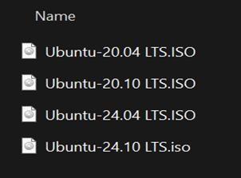
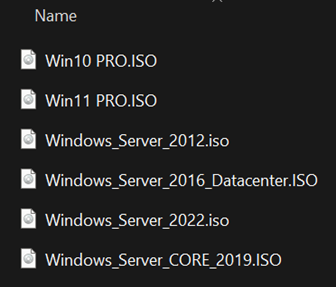
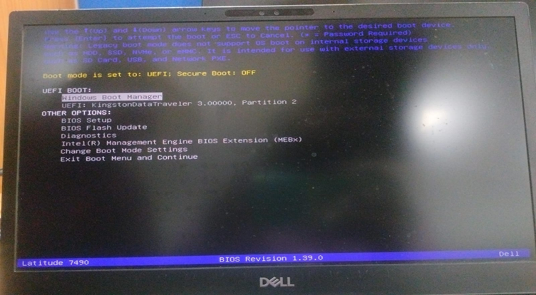
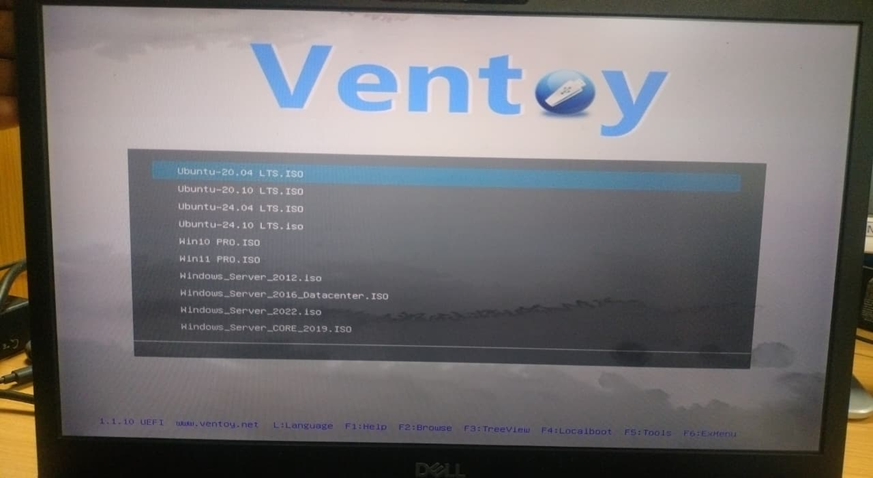

# multi-boot-usb-ventoy
Multi-boot USB setup using Ventoy

# Multi-Boot USB Creation Using Ventoy

This project demonstrates how to create a multi-boot USB drive that allows installation of multiple operating systems (Windows 10, Windows 11, Ubuntu) from a single USB device.

---

## 🎯 Objective
To create a bootable USB drive supporting multiple operating systems using Ventoy.

---

## 📋 Requirements
- Minimum 64GB USB Drive
- Ventoy Software
- ISO Files:
  - Windows 10
  - Windows 11
  - Ubuntu

---

## 🔽 Step 1: Download Ventoy
1. Open browser and go to Ventoy official website  
   👉 https://www.ventoy.net/en/download.html  
2. Download the latest Windows.zip file  
3. Extract the downloaded ZIP file  

---

## ⚙️ Step 2: Install Ventoy on USB
1. Insert the USB drive into the system  
2. Open extracted Ventoy folder  
3. Right-click on `Ventoy2Disk.exe` → Run as Administrator  
4. Select the USB drive  
5. Click on Install  
6. Confirm warnings (USB will be formatted)  

---

## 📁 Step 3: Copy ISO Files
1. Open "This PC"  
2. Open Ventoy USB drive  
3. Copy ISO files directly (no extraction required)  

### Example:
- Win10.iso  
- Win11.iso  
- Ubuntu.iso  

👉 Optional: Create folders (Windows / Ubuntu)

---

## 💻 Step 4: Boot from USB
1. Insert USB into system  
2. Restart system  
3. Press Boot Menu Key:
   - Dell → F12  
   - HP → Esc / F9  
   - Lenovo → F12  
4. Select USB device  

---

## 🖥️ Step 5: Select Operating System
1. Ventoy menu will appear  
2. Select required OS  
3. Choose "Boot in Normal Mode"  

---

## ⚠️ Important Notes
- Do NOT extract ISO files  
- USB will be formatted during setup  
- Ventoy installation is one-time setup  
- You can add more ISO files later  
- Supports both UEFI & Legacy BIOS  

---

## 📸 Screenshots

### Ubuntu Family 

### Windows Family

### Boot Pendrive

### Ventoy Screen After boot

## ✅ Conclusion
Ventoy provides a simple and efficient way to create a multi-boot USB. It eliminates the need for repeated formatting and allows easy management of multiple OS installations.

---

## 👨‍💻 Author
Sudheer
